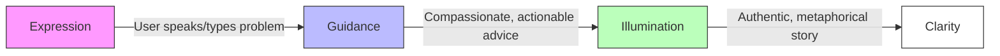
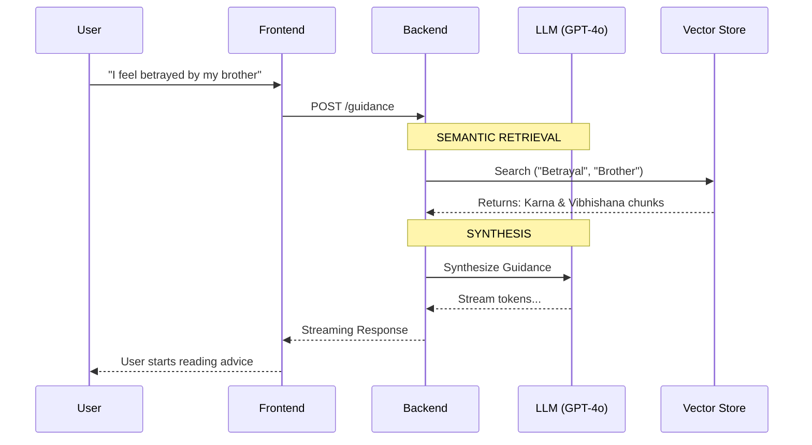
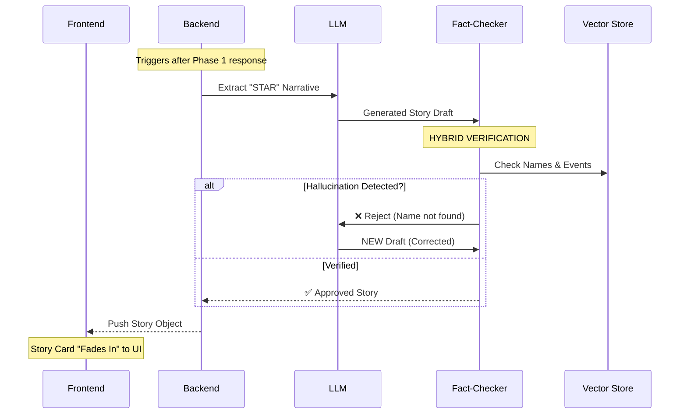
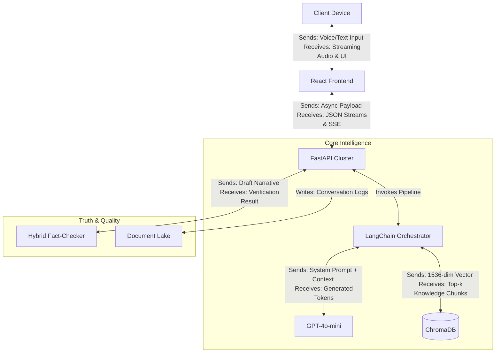
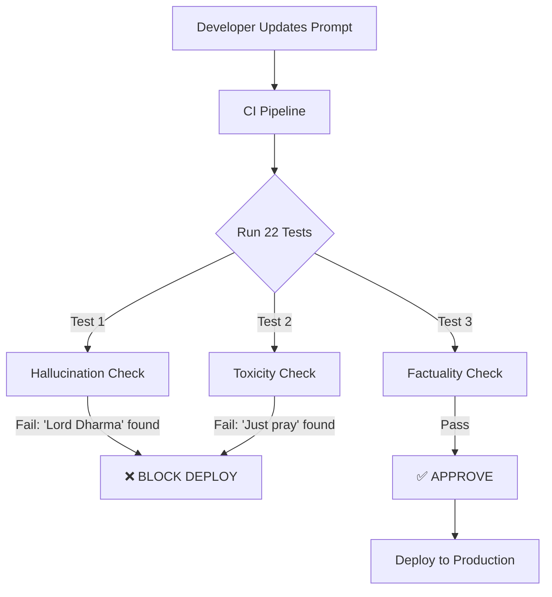
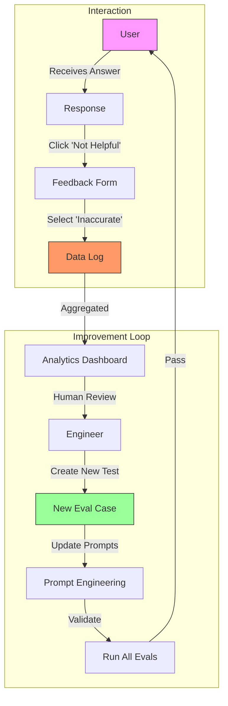

# Vasudeva: AI Wisdom Guidance System
## Project Whitepaper & Technical Interaction Design

### 1. Executive Summary
**Vasudeva** is a specialized **Wisdom Guidance System** designed to provide mental wellness support grounded in authentic sacred texts. Unlike generic AI models that often hallucinate or provide superficial advice, Vasudeva uses a rigorous **RAG (Retrieval-Augmented Generation)** architecture reinforced by a custom **Evaluation System** to verify Truth. It addresses the critical need for ethical, verifiable AI in sensitive domains.

---

### 2. User Journey: The "Digital Darshan"
*From Confusion to Illumination in 3 Steps*

---

### 3. DEEP DIVE: The "Life of a Query"
*What happens in the 3 seconds after you press 'Send'?*

To ensure instant help while performing deep research, we split the process into two phases.

#### Phase 1: Immediate Guidance (0-3s)
*Goal: Instant psychological relief and answer.*

**Detailed Process Description:**
1.  **User Input**: The user expresses a complex emotion ("I feel betrayed...").
2.  **Vector Embedding**: The system instantly converts this text into a 1536-dimensional vector representing its *semantic meaning*.
3.  **Semantic Search**: It queries the ChromaDB vector store for wisdom texts that map to this specific emotional vector (finding concepts like "fratricide", "loyalty", "dharma").
4.  **Synthesis**: The LLM receives the top 3 retrieved passages + the user's query.
5.  **Streaming Response**: Instead of waiting for the full answer, the backend streams the response token-by-token. The user sees the first word within **800ms**, creating a feeling of immediate empathy.

---

#### Phase 2: Deep Background Processing
*Goal: Verifiable Truth & Narrative Depth (Async).*

**Detailed Process Description:**
1.  **Narrative Extraction**: While the user reads the Phase 1 guidance, the system initiates a deeper "Thinking Process". It asks the LLM to find a complete story in the retrieved context that mirrors the user's situation.
2.  **STAR Formatting**: It forces the story into a **Situation-Task-Action-Result** format for educational clarity.
3.  **The "Critic" Loop (Crucial Step)**:
    *   The generated story is passed to a secondary agent, the **Fact-Checker**.
    *   The Fact-Checker compares every entity (Person, Place, Divine Weapon) in the story against the original PDF source text.
    *   *Example*: If the story mentions "Arjuna used the Brahmastra", but the source text says "Arjuna used the Pashupatastra", the Critic **REJECTS** the draft.
4.  **Self-Correction**: The LLM is forced to regenerate the story with the specific error correction.
5.  **Fade-In Delivery**: Only after passing the truth check is the story sent to the frontend, ensuring the user *never* sees a hallucinated version.

---

### 4. System Architecture
High-level decoupled components with precise data flow definitions.

---

### 5. DEEP DIVE: The AI Evaluation System ("The Quality Gate")
*Trust through Verification.*

We have engineered a comprehensive **Evaluation Suite** consisting of **22 automated tests** that run before any deployment. This measures **Hallucinations**, **Toxicity**, and **Correctness**.

#### 5.1. Evals Logic Flow

**Detailed Process Description:**
1.  **Trigger**: A developer updates the system (e.g., "Make the tone friendlier").
2.  **The Gauntlet**: The CI/CD pipeline automatically runs the suite of 22 automated tests.
3.  **Specific Checks**:
    *   **Hallucination Check**: Scans for known fabrications (e.g., checks if "Lord Dharma" appears in a Shakuntala story).
    *   **Toxicity Check**: Scans for harmful advice patterns (e.g., checks if "just pray" is the *only* advice for a medical query).
4.  **The Gate**:
    *   **Block**: If even ONE test fails, the deployment is hard-blocked. The bad code can never reach production.
    *   **Approve**: Only if 100% of tests pass does the code move to the live environment.

---

### 6. The "Virtuous Cycle": How the System Evolves
*Turning User Feedback into Permanent Intelligence.*

This system isn't static. It gets smarter with every interaction through a **Human-in-the-Loop** mechanism.

**Detailed Process Description:**
1.  **The Signal**: A user interacts with the system and notices a subtle error (e.g., "This story ending is different from the book"). They click "Not Helpful".
2.  **Data Capture**: The system flags this specific conversation ID, the retrieval context, and the user's feedback reason ("Inaccurate").
3.  **Human Review**: An engineer reviews the flagged log. "Ah, the model confused character X with character Y."
4.  **The "Immunity" Step**: The engineer creates a **New Test Case** (Test #23) that strictly forbids this specific confusion.
5.  **Refinement**: The prompt is updated to fix the behavior.
6.  **Validation**: The eval suite runs. It now ensures the new fix works AND that no old bugs have returned.
7.  **Result**: The system gets permanently smarter. It will never make that specific mistake again.

---

### 7. Tech Stack & Toolkit

| Layer | Technology | Purpose |
| :--- | :--- | :--- |
| **Frontend** | **React + Vite** | Instant interactions, Skeleton loading states |
| **Styling** | **Tailwind + Framer** | "Glassmorphism" aesthetic, emotional animations |
| **Backend** | **FastAPI** | AsyncIO for handling parallel LLM requests |
| **AI Logic** | **LangChain** | Chain-of-Thought reasoning & retrieval orchestration |
| **Memory** | **ChromaDB** | Semantic search (understanding concepts vs keywords) |
| **Intelligence** | **GPT-4o-mini** | Low-latency reasoning engine |
| **Quality** | **Custom Evals (Python)** | Deterministic quality gates |

---

### 8. Why Vasudeva? (Differentiation)

| **Generic Chatbot** | **Vasudeva System** |
| :--- | :--- |
| Hallucinates to please user | **Self-Corrects** before responding |
| "Black Box" reasoning | **Traceable Sources** (Book/Verse) |
| Static knowledge | **Self-Healing** via Feedback Loop |
| Generic tone | **Curated Compassionate Persona** |

---
**Summary for Board**: Vasudeva is a **Self-Correcting, Truth-Anchored Intelligence Platform**. It leverages GenAI for *accessibility* but relies on architectural rigor for *accuracy*.
